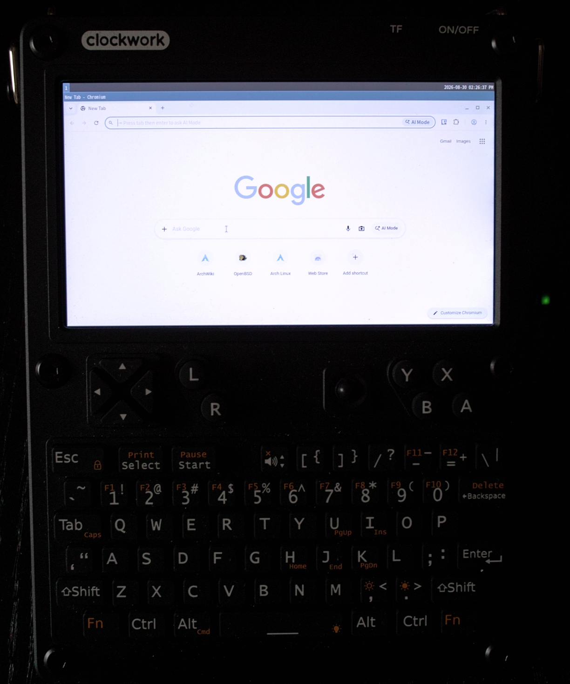
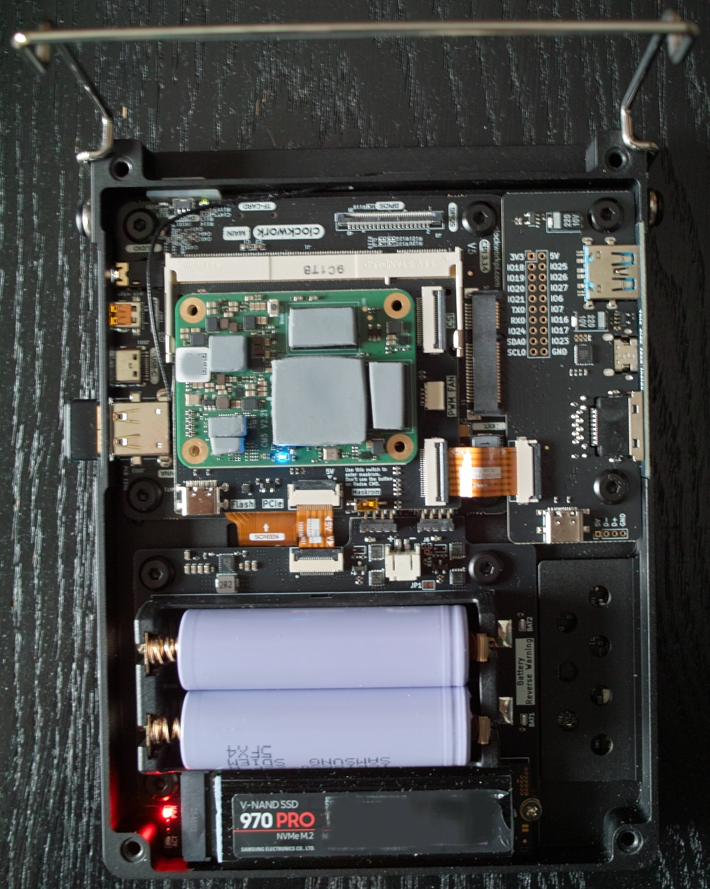

# uConsole + Radxa CM5 on mainline Linux 7.1 / 7.2

Mainline kernel support for the [ClockworkPi uConsole](https://www.clockworkpi.com/uconsole) running a **Radxa CM5** (Rockchip RK3588S) module — including the **new December-2025 LCD revision (TXW500170B0-BL)** that the older community drivers render as garbage.

No BSP tree, no vendor kernel. Just mainline plus one panel driver and one device tree.

Developed on `v7.1`, then rebuilt unchanged on `v7.2` from a clean checkout — same driver, same device tree, same two Kconfig/Makefile lines. The examples below use 7.1; substitute the version you want, or set `KVER` for the build script.

> **About this fork.** Everything upstream describes still applies. On top of it, this fork documents a second, independently brought-up setup: an **original-panel** uConsole, **Debian 13 on the eMMC**, the **HackerGadgets AIO v2** (all of it working, LoRa with one wire on the AIO), a **10 Ah single-cell battery** with the AXP228 tuned for it, and the small tools that came out of it. Start at [Fork additions](#fork-additions).



---

## Status

| Feature | State |
|---|---|
| LCD — TXW500170B0-BL (new, Dec 2025+) | ✅ works |
| LCD — TXW500170B0 (original) | ✅ works — confirmed on a first-generation unit in this fork (`GPIO probe: old panel`, RDID `93 00 00` after the kick) |
| GPU — Mali-G610 (panthor + Mesa panfrost) | ✅ GLES accelerated, glmark2 ≈ 2270 fullscreen |
| Wayland — sway, labwc | ✅ works |
| Internal keyboard + trackball | ✅ works |
| Ethernet (RTL8211F) | ✅ works |
| eMMC + microSD | ✅ works |
| NVMe (HackerGadgets NVMe board, PCIe) | ✅ Gen2 x1 link, works |
| Battery charging | ✅ works |
| Poweroff / reboot | ✅ works (with included shutdown hook) |
| USB (internal hub, external ports) | ✅ works |
| HDMI | ✅ under Wayland (hotplug included); ⚠️ boot console needs it connected at power-on |
| Backlight brightness | ✅ 32 levels with this fork's OCP8178 one-wire driver ([below](#backlight-dimming)); upstream alone is on/off |
| Orange charge LED | ✅ one AXP228 register bit, set by this fork's battery unit — [docs/battery.md](docs/battery.md#the-orange-charge-led) |
| WiFi | via USB dongle (RTW88 configs included; RTL8812AU confirmed with `rtw88_8812au`); CM5 has no onboard radio |
| Audio | ❌ not addressed here (no analog DAC on Radxa CM5); the AIO DTB at least silences the amplifier hiss |
| HackerGadgets AIO v2: GPS, RTL-SDR, USB hub, RJ45 | ✅ works with the AIO DTB — [docs/aio-v2.md](docs/aio-v2.md) |
| HackerGadgets AIO v2: RTC | ✅ works on I2C7, the slot's real I²C bus — [docs/aio-v2.md](docs/aio-v2.md#rtc-works-on-i2c7) |
| HackerGadgets AIO v2: LoRa | ✅ with one wire on the AIO (MISO pad to test pad TP2) and the `aio-lora` DTB: as delivered MISO ends on a module position the Radxa CM5 leaves unconnected; meshtasticd runs, over-the-air traffic not yet confirmed — [docs/aio-v2.md](docs/aio-v2.md#lora-no-miso-path-as-delivered) |

**Known workaround required:** the first DSI enable at boot wedges the controller (see [Troubleshooting](docs/troubleshooting.md)). A one-shot systemd service cycles the display at boot and fixes it. This looks like a genuine mainline `dw-mipi-dsi2` bug, not something specific to this board.

---

## Hardware this was built and tested on



- ClockworkPi uConsole (2026 revision, **TXW500170B0-BL** panel — check the sticker on the back of the LCD)
- Radxa CM5 (RK3588S), 8 GB / 64 GB eMMC
- HackerGadgets Radxa CM5 adapter board
- HackerGadgets NVMe board (Samsung SM981 SSD)
- Arch Linux ARM userspace, Mesa 26.1.4, panthor 1.8.0, CSF firmware v1.5.0

The fork's second setup, which confirmed the original-panel path:

- ClockworkPi uConsole (first generation, **TXW500170B0** panel)
- Radxa CM5 (RK3588S), 32 GB / 256 GB eMMC
- HackerGadgets Radxa CM5 adapter board, HackerGadgets **AIO v2** with an Intel 512 GB NVMe
- RTL8812AU USB WiFi module, 10 Ah single-cell battery
- Debian 13 (Trixie) userspace, Mesa 25, kernel 7.2.6 built with this repo

If your hardware differs — no NVMe board, a different adapter — the device tree may need edits. The panel revision is detected at runtime, so **both panel types should work**; the NVMe/PCIe nodes are harmless if the board is absent.

---

## ⚠️ Read this before you deploy anything

**Keep a working boot entry.** Install this kernel *alongside* your existing one and leave the old entry intact. If something goes wrong you flip one line in `extlinux.conf` and you're back — no reflashing, no disassembly.

This project was developed exactly that way: a working BSP image as fallback, the mainline kernel as a second entry, iterating over SSH. See [`runtime/extlinux.conf.example`](runtime/extlinux.conf.example).

**Recovery:** power off, put the boot media in another machine, change `default` back to your known-good label.

---

## Quick start (prebuilt binaries)

If a [Release](../../releases) is attached, it carries a prebuilt `Image`, DTB and modules tarball — a **convenience build, offered as-is and unsupported**, produced from the exact sources in this repo for the exact hardware listed above. If there's no Release yet, build from source below; that's the supported path regardless.

```bash
# On the device. ADD a boot entry — do not replace your existing one.
sudo tar xf uconsole-cm5-modules.tar.gz -C /
sudo cp Image-7.1 /boot/
sudo mkdir -p /boot/dtb-7.1
sudo cp rk3588s-radxa-cm5-uconsole.dtb /boot/dtb-7.1/
```

Then add the boot entry and runtime files — see [Deploy](#4-deploy) and [Runtime configuration](#runtime-configuration) below.

---

## Build from source

Works both **natively on the uConsole** and **cross-compiled from an x86_64 host**; the build script detects which.

### 1. Get the kernel

```bash
git clone --depth=1 -b linux-7.1.y \
  https://git.kernel.org/pub/scm/linux/kernel/git/stable/linux.git linux-7.1
```

### 2. Apply this repo's additions

```bash
git clone https://github.com/tdeval/uconsole-radxa-cm5-mainline.git
cd linux-7.1

# Panel driver
cp ../uconsole-radxa-cm5-mainline/kernel/panel-cwu50.c drivers/gpu/drm/panel/

# Register it (append — position in the file does not matter)
cat >> drivers/gpu/drm/panel/Kconfig << 'EOF'

config DRM_PANEL_CLOCKWORKPI_CWU50
	tristate "ClockworkPi uConsole CWU50 panel (JD9365DA-H3)"
	depends on OF
	depends on DRM_MIPI_DSI
	depends on BACKLIGHT_CLASS_DEVICE
	depends on REGULATOR
	help
	  ClockworkPi uConsole 5" 720x1280 DSI panel.
	  Supports TXW500170B0 and TXW500170B0-BL (Dec 2025+).
EOF
echo 'obj-$(CONFIG_DRM_PANEL_CLOCKWORKPI_CWU50) += panel-cwu50.o' \
  >> drivers/gpu/drm/panel/Makefile

# Device tree
cp ../uconsole-radxa-cm5-mainline/kernel/rk3588s-radxa-cm5-uconsole.dts \
   arch/arm64/boot/dts/rockchip/
sed -i '/rk3588s-radxa-cm5-io.dtb/a dtb-$(CONFIG_ARCH_ROCKCHIP) += rk3588s-radxa-cm5-uconsole.dtb' \
  arch/arm64/boot/dts/rockchip/Makefile

# Optional: the HackerGadgets AIO v2 variant (GPS on ttyS2, RTC, no serial console,
# 10 Ah battery labels, OCP8178 backlight dimming) — see docs/aio-v2.md
cp ../uconsole-radxa-cm5-mainline/kernel/rk3588s-radxa-cm5-uconsole-aio.dts \
   arch/arm64/boot/dts/rockchip/
sed -i '/rk3588s-radxa-cm5-uconsole.dtb/a dtb-$(CONFIG_ARCH_ROCKCHIP) += rk3588s-radxa-cm5-uconsole-aio.dtb' \
  arch/arm64/boot/dts/rockchip/Makefile

# Optional, only for an AIO v2 with the LoRa MISO wire (docs/aio-v2.md, "The one-wire fix"):
# the AIO variant plus a bit-banged SPI bus for the SX1262 -> /dev/spidev5.0
cp ../uconsole-radxa-cm5-mainline/kernel/rk3588s-radxa-cm5-uconsole-aio-lora.dts \
   arch/arm64/boot/dts/rockchip/
sed -i '/rk3588s-radxa-cm5-uconsole-aio.dtb/a dtb-$(CONFIG_ARCH_ROCKCHIP) += rk3588s-radxa-cm5-uconsole-aio-lora.dtb' \
  arch/arm64/boot/dts/rockchip/Makefile

# Battery status fix: report "Full" once the AXP has terminated instead of
# "Charging" forever (docs/battery.md); applies to 7.2 and current mainline
patch -p1 < ../uconsole-radxa-cm5-mainline/kernel/0001-axp20x_battery-report-full-after-charge-termination.patch

# Required by the AIO variant: the OCP8178 backlight driver
cp ../uconsole-radxa-cm5-mainline/kernel/ocp8178_bl.c drivers/video/backlight/
sed -i '/^endif # BACKLIGHT_CLASS_DEVICE/i \
config BACKLIGHT_OCP8178\n\ttristate "Orient-Chip OCP8178 one-wire backlight (ClockworkPi uConsole)"\n\tdepends on GPIOLIB \&\& OF\n\thelp\n\t  32-level brightness control for the OCP8178 LED driver on the\n\t  ClockworkPi uConsole mainboard, over its single EN line.\n' \
  drivers/video/backlight/Kconfig
echo 'obj-$(CONFIG_BACKLIGHT_OCP8178)	+= ocp8178_bl.o' >> drivers/video/backlight/Makefile
grep -c BACKLIGHT_OCP8178 drivers/video/backlight/Kconfig   # must be 1
```

> **Do not** use `sed -i '/^config DRM_PANEL_/i ...'` to insert the Kconfig entry — it matches ~80 lines and inserts a copy before every one of them.

### 3. Configure and build

```bash
cp ../uconsole-radxa-cm5-mainline/kernel/build-uconsole-kernel.sh ~/
KDIR=$PWD ~/build-uconsole-kernel.sh
```

The script regenerates `.config` from `defconfig` + the fragment, verifies the critical symbols are set, builds `Image modules dtbs`, and stages modules. It is safe to re-run after `make distclean` — **the config is never the source of truth, the fragment is.**

Cross-compiling needs `aarch64-linux-gnu-gcc`; native builds need nothing extra. Native build on the CM5 takes roughly an hour with `-j8`.

### 4. Deploy

**Three artifacts must be deployed together. A stale DTB fails silently** — the kernel boots with your old device tree and you chase ghosts. (Ask me how I know.)

```bash
KREL=$(cat include/config/kernel.release)

sudo cp arch/arm64/boot/Image /boot/Image-7.1
sudo mkdir -p /boot/dtb-7.1
sudo cp arch/arm64/boot/dts/rockchip/rk3588s-radxa-cm5-uconsole.dtb /boot/dtb-7.1/
sudo rsync -a --no-o --no-g ~/staging/modules-7.1/lib/modules/$KREL /lib/modules/
```

Add a boot entry to `/boot/extlinux/extlinux.conf` — keep your existing entry:

```
default uconsole-71-mainline

label uconsole-71-mainline
    menu label uConsole mainline 7.1
    kernel /boot/Image-7.1
    fdt /boot/dtb-7.1/rk3588s-radxa-cm5-uconsole.dtb
    append root=PARTUUID=YOUR-PARTUUID-HERE rootfstype=ext4 rootwait rw console=ttyS4,1500000 console=tty1 consoleblank=0 loglevel=7 panic=10
```

> **Use `root=PARTUUID=`, not `root=UUID=`.** This kernel is built without an initramfs, and a bare kernel cannot resolve filesystem UUIDs. Get yours with `lsblk -o NAME,PARTUUID`.
>
> **Do not add `earlycon=`.** It touches UART4 before its clock is ungated and hard-hangs the boot with no output at all.

After rebooting, verify you're actually running what you built:

```bash
uname -r                                                          # 7.1.0
tr -d '\0' < /sys/firmware/devicetree/base/pcie@fe190000/status    # okay
sudo dmesg | grep cwu50                                            # panel: TXW500170B0-BL (new)
```

---

## Runtime configuration

Copy from [`runtime/`](runtime/):

```bash
# REQUIRED — works around the DSI first-enable bug (otherwise: grey screen)
sudo cp runtime/display-kick.service /etc/systemd/system/
sudo systemctl enable display-kick.service

# Full power-off (cuts the AXP rails, not just the CM5 module)
sudo cp runtime/axp-off.sh /usr/lib/systemd/system-shutdown/
sudo chmod +x /usr/lib/systemd/system-shutdown/axp-off.sh

# Bounds the shutdown hang if a driver stalls (hardware watchdog fallback)
sudo mkdir -p /etc/systemd/system.conf.d
sudo cp runtime/reboot-watchdog.conf /etc/systemd/system.conf.d/
```

### Wayland

**sway** reads the panel orientation from the device tree and rotates itself correctly — nothing to configure.

**labwc** does not; give it an autostart:

```bash
mkdir -p ~/.config/labwc
cp runtime/labwc-autostart ~/.config/labwc/autostart
chmod +x ~/.config/labwc/autostart
```

Idle screen-off works with `swayidle` calling `swaymsg output DSI-1 power off` — the backlight really does cut.

Confirm you have hardware acceleration and not a software fallback:

```bash
glxinfo | grep -i renderer     # want "Mali-G610 MC4 (Panfrost)", not "llvmpipe"
```

---

## Fork additions

Each of these is self-contained and optional. The files live under `runtime/` and `tools/`; the write-ups are in `docs/`.

| Topic | Read | Files |
|---|---|---|
| HackerGadgets AIO v2 on the CM5: rails, GPS, SDR, RTC, LoRa with the TP2 wire, the AIO device trees | [docs/aio-v2.md](docs/aio-v2.md) | [`runtime/aio-v2/`](runtime/aio-v2/), [`tools/patch-uconsole-dtb.py`](tools/patch-uconsole-dtb.py), [`tools/sx1262-bitbang.py`](tools/sx1262-bitbang.py) |
| Battery: the supply-sag trap, charger requirements, AXP228 cutoff and fuel-gauge capacity, clean low-battery poweroff, permanent battery log | [docs/battery.md](docs/battery.md) | [`runtime/battery/`](runtime/battery/) |
| Debian 13 on the eMMC: flashing, rescue SD, boot entries that survive `apt`, Trixie upgrade | [docs/debian.md](docs/debian.md) | [`runtime/debian/`](runtime/debian/) |
| Backlight dimming: OCP8178 one-wire driver, 32 levels | [below](#backlight-dimming) | [`kernel/ocp8178_bl.c`](kernel/ocp8178_bl.c) |
| Every header pin with its mainboard net and CM5 alternate functions, and how the mPCIe slot is really routed | [docs/gpio-map.md](docs/gpio-map.md) | – |

Quick install of the runtime pieces (details and the reasons behind each in the linked docs):

```bash
# AIO v2 rails (needs libgpiod v2 bindings: python3-libgpiod)
sudo install -m 755 runtime/aio-v2/aio /usr/local/bin/aio
sudo cp runtime/aio-v2/aio-rails.service /etc/systemd/system/ && sudo systemctl enable aio-rails.service
sudo mkdir -p /etc/systemd/system/gpsd.service.d
sudo cp runtime/aio-v2/gpsd-rail.conf /etc/systemd/system/gpsd.service.d/rail.conf

# Battery: AXP settings on every boot, clean poweroff at 3.50 V
sudo cp runtime/battery/axp-battery-config.service /etc/systemd/system/   # edit the capacity bytes first
sudo systemctl enable --now axp-battery-config.service
sudo install -m 755 runtime/battery/battery-guard /usr/local/bin/
sudo cp runtime/battery/battery-guard.{service,timer} /etc/systemd/system/
sudo systemctl enable --now battery-guard.timer
# Battery: one CSV line a minute, so a charge or discharge can be measured after the fact
sudo install -m 755 runtime/battery/battery-log /usr/local/bin/
sudo cp runtime/battery/battery-log.{service,timer} runtime/battery/battery-log-shutdown.service /etc/systemd/system/
sudo cp runtime/battery/battery-log.logrotate /etc/logrotate.d/battery-log
sudo systemctl enable --now battery-log.timer battery-log-shutdown.service

# Debian only: keep the mainline boot entry across apt runs
sudo cp /boot/extlinux/extlinux.conf /root/extlinux.conf.mainline
sudo cp runtime/debian/99-restore-extlinux /etc/apt/apt.conf.d/
sudo systemctl daemon-reload
```

### Backlight dimming

Upstream drives the OCP8178 backlight chip with `gpio-backlight`, so it is on or off. The chip's EN pin also speaks a one-wire protocol, a shutdown-plus-detect sequence followed by an address byte and a 5-bit level, and ClockworkPi's downstream kernels have used it for years. [`kernel/ocp8178_bl.c`](kernel/ocp8178_bl.c) is a mainline-style driver for that protocol: 32 levels at `/sys/class/backlight/backlight/brightness`, so `brightnessctl`, sway's idle handling and the desktop sliders work. Unlike the downstream driver it enters the one-wire mode only when the chip was off, instead of blanking the panel for 3 ms with interrupts disabled on every change; `always_reenter=1` as a module parameter restores the downstream behaviour if a level ever fails to stick. Entering the mode starts with 3 ms of EN low, which also clears the latched-off state described in [troubleshooting](docs/troubleshooting.md#lcd-completely-dark-backlight-latched-off).

The AIO DTS switches the backlight node to this driver. Build step 2 above copies the driver and adds its Kconfig and Makefile lines; the build script checks that `CONFIG_BACKLIGHT_OCP8178=y` ended up in the config, because a kernel without the driver and a DTB that asks for it leaves the panel waiting for its backlight and the screen dark.

**Status: tested 2026-09-20/21** on the original-panel unit: levels 0 to 31 take effect from sysfs, the panel comes back at the previously set level after being powered off and on again (sway's idle path and GNOME's screen blanking alike), and under GNOME the keyboard's brightness keys and the Settings slider control it, so the enter-once logic holds in daily use. Quick check after building:

```bash
sudo dmesg | grep -i ocp8178                              # "OCP8178 one-wire backlight, 31 levels, default 31"
cat /sys/class/backlight/backlight/max_brightness         # 31
echo 8  | sudo tee /sys/class/backlight/backlight/brightness   # visibly dimmer
echo 31 | sudo tee /sys/class/backlight/backlight/brightness   # back to full
```

If a level ever fails to stick, retry with the downstream behaviour before assuming the protocol is wrong: `echo 1 | sudo tee /sys/module/ocp8178_bl/parameters/always_reenter`, then set the brightness again. Note that `actual_brightness` only echoes the last written value; the chip cannot be read back.

### Repository layout

```
kernel/    panel driver, OCP8178 backlight driver, AXP battery status patch, device tree (+ AIO v2 variant), build script
runtime/   system files: display kick, shutdown hook, watchdog, labwc autostart, extlinux example
  aio-v2/  rail switch `aio`, its boot unit, gpsd drop-in, meshtasticd reference config
  battery/ AXP228 settings unit, low-battery guard + timer, minute-by-minute battery log + timer
  debian/  apt hook that restores the mainline boot entry
tools/     patch-uconsole-dtb.py (AIO nodes into a built DTB), sx1262-bitbang.py and lora-miso-scan.py (LoRa MISO probes)
docs/      gpio-map, troubleshooting, aio-v2, battery, debian, kernel-guide
```

---

## What's in the device tree

Beyond the stock `rk3588s-radxa-cm5.dtsi`:

- **CWU50 panel** on DSI1 → mipidcphy1 → VOP2 **VP3**, with `rotation = <90>`
- **AXP228 PMU** on bit-banged I²C (CM4 `ID_SD`/`ID_SC` → GPIO1_D7/D6), providing the panel's `vci` (1.8 V) and `iovcc` (3.3 V) rails, plus battery/AC power supplies
- **GPIO backlight** on GPIO1_B1
- **UART4 (`m2` pinmux)** as the debug console — the SoC's default uart2 routes to Mini-PCIe on this chassis and is physically unreachable
- **USB PHYs** (`usbdp_phy0`, `combphy0_ps`, `combphy2_psu`) — without these the dwc3 controllers defer forever and the internal keyboard never appears
- **PCIe** `pcie2x1l2` + 3.3 V regulator for the NVMe board
- **`mmu600_pcie` disabled** — its shutdown handler hangs reboot; PCIe works fine without it

Full pin mapping in [`docs/gpio-map.md`](docs/gpio-map.md).

The fork adds [`kernel/rk3588s-radxa-cm5-uconsole-aio.dts`](kernel/rk3588s-radxa-cm5-uconsole-aio.dts), which includes the base file and enables UART2 for the AIO v2 GPS, I2C7 with the AIO's RTC, disables the UART4 console in favour of holding the amplifier enable low, and carries the 10 Ah battery labels. It builds alongside the base DTB; `DTBS_ONLY=1` in the build script rebuilds just the device trees. A third file, [`kernel/rk3588s-radxa-cm5-uconsole-aio-lora.dts`](kernel/rk3588s-radxa-cm5-uconsole-aio-lora.dts), includes the AIO variant and adds a software SPI bus for an AIO whose LoRa MISO has been wired to its TP2 pad ([docs/aio-v2.md](docs/aio-v2.md#the-one-wire-fix)); it needs `CONFIG_SPI_GPIO`, which the build script's fragment now sets. [`tools/patch-uconsole-dtb.py`](tools/patch-uconsole-dtb.py) produces the same tree from a prebuilt DTB without a kernel tree.

---

## Serial console

UART4, **1,500,000 baud** (not 115200) on the GPIO connector:

| uConsole pin | Signal | Adapter |
|---|---|---|
| PIN_23 | UART4 TX | RX |
| PIN_19 | UART4 RX | TX |
| PIN_25 | GND | GND |

PL2303x and CH340 adapters **cannot** do 1.5 Mbps. Use a CP2102N, FT232H, or CH343P.

---

## Troubleshooting

The things that cost the most time during bring-up — inverted panel detection, the DSI first-enable wedge, the SMMU shutdown hang, the earlycon trap, and more — are written up in [`docs/troubleshooting.md`](docs/troubleshooting.md). The fork added the power-supply section (a sagging battery looks exactly like a broken device tree) and the Debian traps.

---

## Contributing

Useful things to report:

- **Original (pre-2025) panel:** confirmed working on one unit (see Status); more reports still welcome. `dmesg | grep cwu50`
- **AIO v2 LoRa over the air**: a second node in range of a uConsole with the TP2 wire ([docs/aio-v2.md](docs/aio-v2.md#the-one-wire-fix)), transmit behaviour, and why the chip needs a rail cycle after a reset pulse
- **Other adapters / no NVMe board:** what needed changing in the DTS
- **HDMI hotplug**, **backlight dimming**, **charge LED** — all open

## Credits

- [@ak-rex](https://github.com/ak-rex) — the original `panel-cwu50` driver and both JD9365DA-H3 init sequences, without which none of this exists. This driver is a port of that work to the mainline panel API.
- [@dev-null2019](https://github.com/dev-null2019) — Radxa CM5 uConsole device tree overlays that mapped out the hardware
- randomlinuxuser — Arch Linux Radxa CM5 image, used as the fallback system throughout development
- Rockchip / Radxa / Collabora upstream work that put RK3588 DSI2 and DCPHY into mainline
- Radxa's CM5 pinout spreadsheet (`radxa_cm5_v2200_pinout.xlsx`) and ClockworkPi's mainboard and adapter schematics — the sources of the pin map; neither is included in this repo
- [508-dev/uconsole-scripts](https://github.com/508-dev/uconsole-scripts) — the Pi-side pin numbers for the AIO v2 LoRa module

## License

GPL-2.0+, matching the kernel. `panel-cwu50.c` is derived from GPL-2.0+ code by ClockworkPi / ak-rex.
